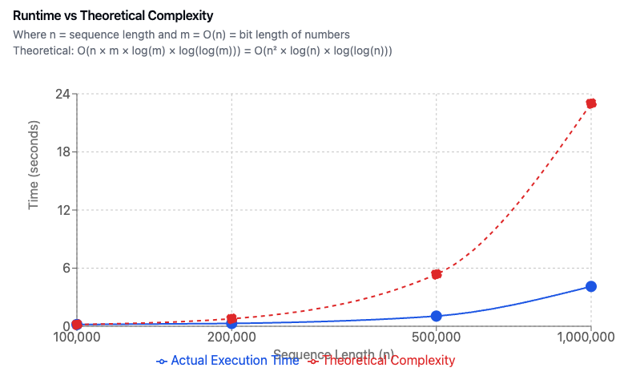

# Layup Sequence

This program calculates the Layup Sequence value for a given number `n`. The sequence is defined as follows:

```
n = 1 , 1
n = 2 , 2
n is even, S(n - 1) + S(n - 2)
n is odd, 2S(n - 1) - S(n - 2)
```

## How to Run

To run the program with a value of `n` of 10000, use the following command:

```sh
go run main.go 10000
```

## Big O Complexity

The algorithm used in this program has an initial time complexity of `O(n)`, where `n` is the nth number in the Layup Sequence.

Additionally, the addition and subtraction operations using the `big.Int` library take `O(n)` where `n` is the number of digits in the values being added. While multiplication is implemented using the Schönhage-Strassen Algorithm which has a time complexity of `O(n * log(n) * log(log(n)))`.

## Overall Time Complexity

- _For the following assume that:_

  - `sequenceIterations` is the number of iterations the loop runs.

  - `n` is the number of digits in the `big.Int` numbers being processed.

- The loop runs `sequenceIterations` - 2 times.
- Half of the iterations (approximately) involve `O(n)` operations.
- The other half involve `O(n * log(n) * log(log(n)))` operations.

Therefore, the overall time complexity of the function is:

`O((sequenceIterations / 2) * n + (sequenceIterations / 2) * n * log(n) * log(log(n)))`

Simplifying, we get:

`O(sequenceIterations * (n + n * log(n) * log(log(n))) / 2)`

Since `n * log(n) * log(log(n))` dominates `n` for large values of `n`, we can further simplify to:

`O(sequenceIterations * n * log(n) * log(log(n)))`

The space complexity is `O(1)` as the program uses a constant amount of additional space.

## Real life performance plotting


